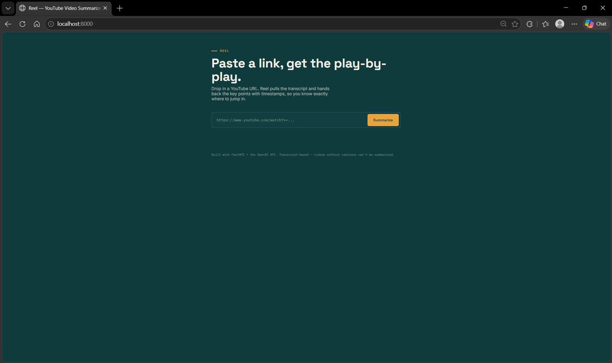
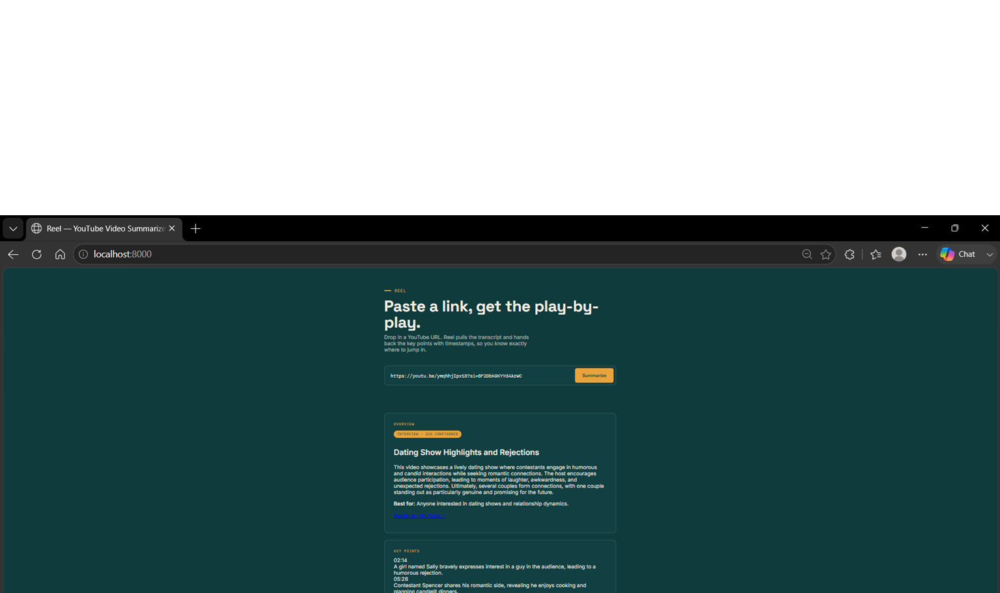

# Reel — YouTube Video Summarizer


**[🔗 Try it live](https://yt-summarizer-0aui.onrender.com)**


Paste a YouTube URL, get a structured summary: overview, audience, and 5–10 key points
each tied to a timestamp in the video.

**Stack:** Python, FastAPI, OpenAI API, `youtube-transcript-api`.

## Screenshots




## How it works

1. `youtube-transcript-api` pulls the video's caption track (works for auto-generated
   captions too — no audio download or Whisper needed).
2. The transcript (with inline timestamps) is sent to the OpenAI API with a prompt that
   forces structured JSON output matching a fixed schema.
3. FastAPI validates that JSON against a Pydantic model and returns it to the frontend,
   which renders it as a timeline.

## Setup

```bash
cd yt-summarizer
python3 -m venv venv
source venv/bin/activate        # Windows: venv\Scripts\activate
pip install -r requirements.txt
```

Set your OpenAI API key as an environment variable:

```bash
export OPENAI_API_KEY="sk-..."       # Windows (PowerShell): $env:OPENAI_API_KEY="sk-..."
```

## Run

```bash
uvicorn app.main:app --reload --port 8000
```

Open **http://localhost:8000** — paste a YouTube URL and hit Summarize.

## API

`POST /api/summarize`

```json
{ "url": "https://www.youtube.com/watch?v=dQw4w9WgXcQ" }
```

Returns:

```json
{
  "video_id": "dQw4w9WgXcQ",
  "video_url": "https://www.youtube.com/watch?v=dQw4w9WgXcQ",
  "summary": {
    "title_guess": "...",
    "overall_summary": "...",
    "audience": "...",
    "key_points": [
      { "timestamp": "00:42", "point": "..." }
    ]
  }
}
```

## Project structure

```
yt-summarizer/
├── app/
│   ├── main.py         # FastAPI app + routes
│   ├── summarizer.py   # transcript fetching + OpenAI summarization
│   └── models.py       # Pydantic schemas
├── static/
│   └── index.html      # single-page frontend
├── requirements.txt
└── README.md
```

## Notes & limitations

- Only works for videos that have an available English transcript (manual or
  auto-generated captions). Videos with captions disabled will return a clear error.
- Long videos are truncated before being sent to the model to control token usage/cost.
- Hosted on Render's free tier — the live demo may take ~30-50 seconds to wake up if it's
  been idle.
- The live demo may fail to fetch transcripts for some videos. This is because 
  YouTube blocks caption requests coming from cloud server IPs (a known limitation 
  of `youtube-transcript-api` on platforms like Render, Railway, and Fly.io). 
  The app works reliably when run locally, since it's not coming from a flagged IP range.
